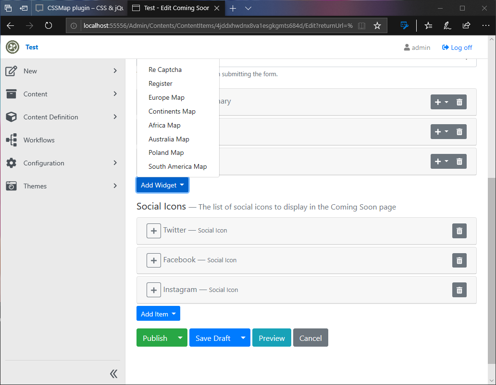
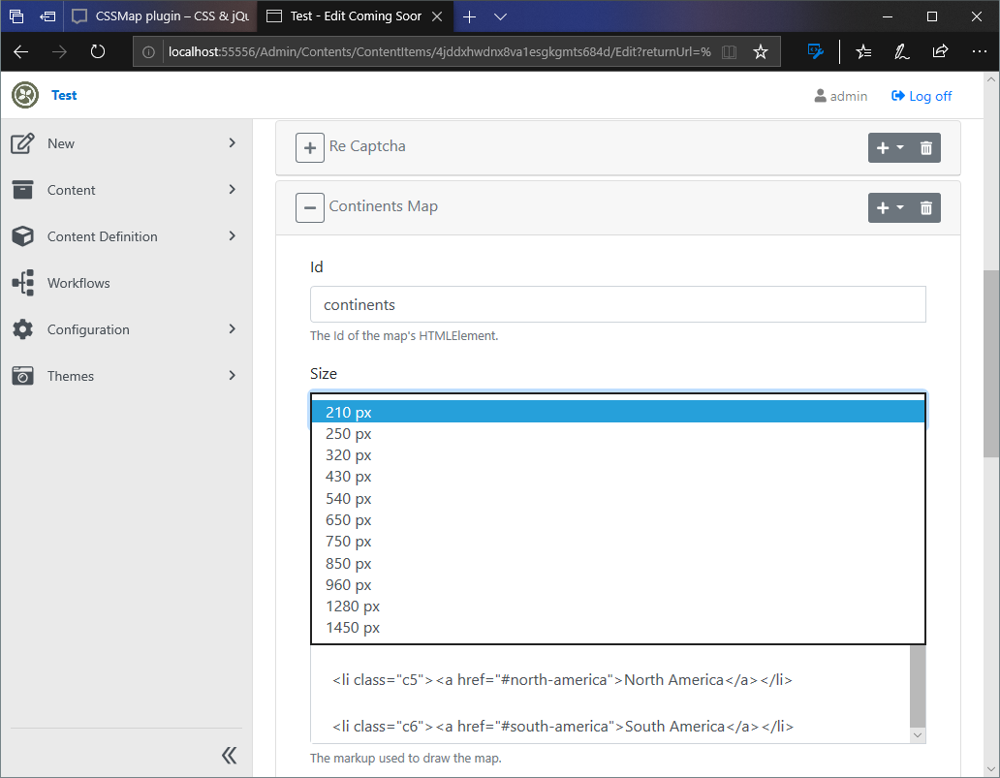

# CSSMap.OrchardCore
Integrate CSS Map widgets in Orchard Core

## CSSMAP PLUGIN
[CSSMAP PLUGIN](https://cssmapsplugin.com/) script converts a simple list of regions into fully responsive interactive map using well known CSS sprites. This module defines a cssMapPart and a list of free map widgets. You can purchase a map and easily define a widget for quick use in Orchard CMS.

### Usage

Just add a widget to a Content Type that supports widgets. 

Enable the module 

Add a map Widget 

Configure the widget 

Publish 

### Extend

Integrate purchased map's css and assets in your theme. Create a new widget. Use the widget in your content items.

